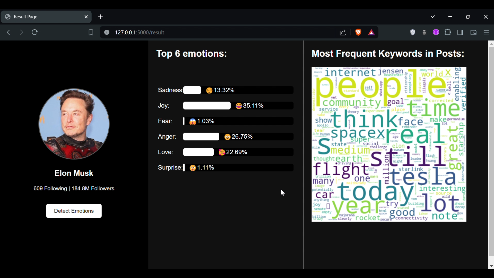
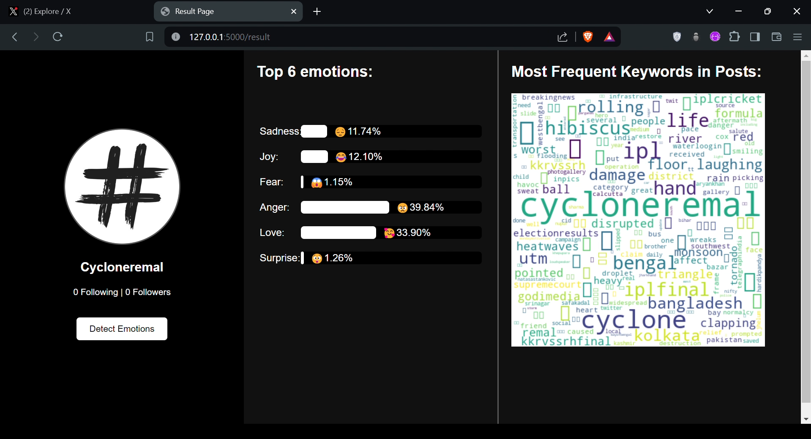

# Sentiment Analysis using LSTM

This repository contains the code and data for a sentiment analysis project using LSTM (Long Short-Term Memory) networks. The project focuses on classifying text data into different emotion categories using natural language processing techniques.

## Project Structure

The project is structured into several components:

1. **Model Preparation**: Contains the notebook (`notebook3.ipynb`) used for model training and creation, along with the dataset stored in the `dataset` folder.
   
2. **Flask Web App**: The `web_app` folder contains a Flask application (`app.py`) that allows users to analyze tweets or hashtags for emotions. It uses the trained LSTM model for prediction and generates emotion reports.

## Flask Web App

The Flask web app (`app.py`) provides the following functionality:

- **Index Page**: Allows users to input a Twitter username or hashtag.
- **Result Page**: Displays profile information if a username is provided or generates an emotion report if a hashtag is provided.
- **Emotion Detection**: Analyzes tweets for emotions such as Angry, Sad, Joy, Surprise, Love, and Fear using the trained model.
- **Word Cloud Generation**: Generates a word cloud based on analyzed tweets.

## Usage

To use the Flask web app:

1. Navigate to the `Web App` directory.
2. Install the required dependencies .
3. Run the Flask application (`python app.py`).
4. Access the application in your web browser at `http://localhost:5000`.

## Requirements

Ensure you have the necessary dependencies installed as specified in `requirements.txt` for both the model training environment and the Flask web app environment.

## Future Improvements

Potential areas for improvement include:

- Enhancing the web interface with additional features.
- Optimizing the emotion detection model for real-time performance.
- Handling larger datasets or streaming data for continuous analysis.

## Contributors

- [Sk Akram]([https://github.com/sk-akram]) - Main Developer

## License

This project is licensed under the MIT License - see the LICENSE file for details.

## Web App GUI Workflow

Check out the video demonstrations of the web app GUI workflow:

